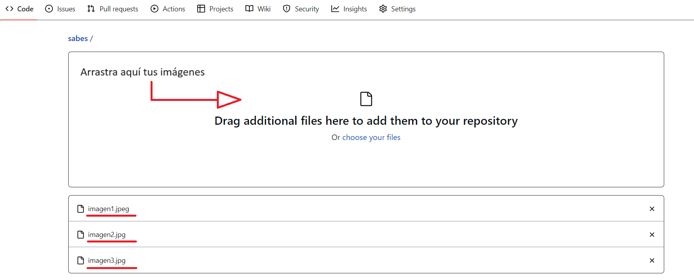
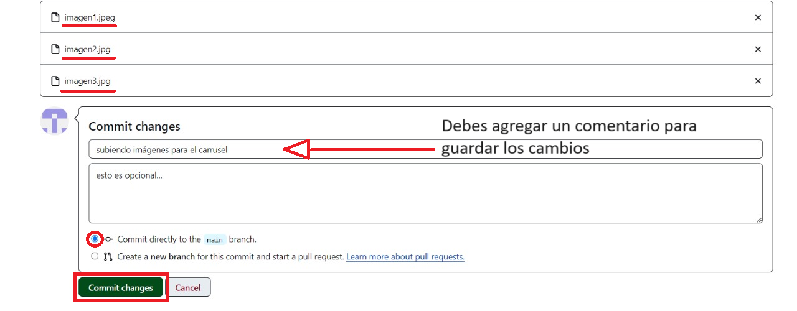
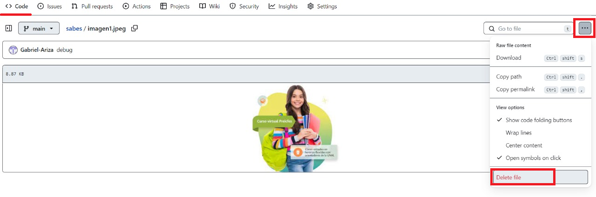
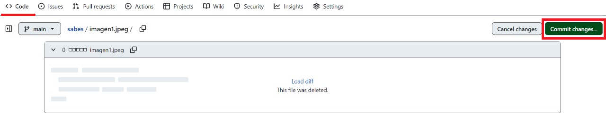

# 👩‍💻 Guía Rápida Repositorio de imágenes 📸

<i>
Aquí encontrarás instrucciones paso a paso sobre cómo agregar y eliminar imágenes en este repositorio.
</i>

 

## 📌Añadir una Imagen

#### **1.** 🚀 Haz clic en el botón "Add File" y selecciona "Upload files".

   

 

#### **2.** Arrastra tus imágenes al área designada o haz clic en "Choose your files" para seleccionar archivos manualmente.

   

#### **3.** Espera a que los archivos se carguen y aparecerán en la lista.

#### **4.** 📝 Proporciona una breve descripción de los cambios en el campo "Commit changes".

#### **5.** Haz clic en "Commit changes" para confirmar la carga de las imágenes.

   
 

 

## 🗑️Eliminar una Imagen

#### **1.** 🎯 Navega hasta el archivo que deseas eliminar.

#### **2.** Haz clic en el archivo para abrirlo.

#### **3.** En la esquina superior derecha, haz clic en el ícono de la papelera.

   

#### **4.** 📝 Proporciona una breve descripción de los cambios en el campo "Commit changes".

   

#### **5.** Haz clic en "Commit changes" para confirmar la eliminación del archivo.
 

 
 
<i>
¡Y eso es todo! Siguiendo estos sencillos pasos, podrás gestionar fácilmente las imágenes que aparecen en el carrusel de su sitio web. Si tienes alguna pregunta o problema, no dudes en contactarnos.
</i>